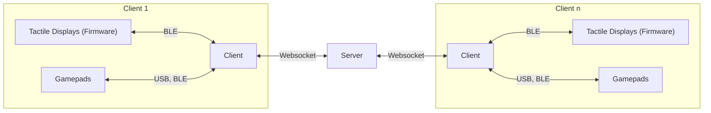
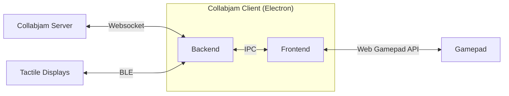

# CollabJam

base repo used to organize collaboration across hardware and software development.

| Repository     | Description                                                                                  |
| -------- | -------------------------------------------------------------------------------------------- |
| [Client](https://github.com/TactileVision/CollabJam-Client)   | Electron Application that provides a GUI for colloratively creating vibration output         |
| [Server](https://github.com/TactileVision/CollabJam-Server)   | NodeJS server application that connects multiple clients                                     |
| [Shared](https://github.com/TactileVision/CollabJam-Firmware)   | Typescript types used both by the client and the server                                      |
| [Firmware](https://github.com/TactileVision/CollabJam-Firmware) | Firmware for ESP32 boards to communicate with the Collabjam Client via BLE, uses Platformio  |

Server client communication

## Server (TODO)

- NodeJS application
- Responsibilites
  - Sharing rooms with each client
  - Receiving and broadcasting tactile messages on a per room basis

### Data Structures

- Room Configuration
- Tacton JSON

## Client (TODO)

<!-- ### Application Information -->

### Software Components

#### Electron

##### IPC Messages (Client)

#### Frontend

#### Backend

### Folder Structure

## Firmware (TODO)

## Inter Component Communication (TODO)

### Websocket Communication between Server and Client (Shared Library)

### Tactile Display  (Client - Firmware)

#### BLE Protocol

#### MIDI Implementation
