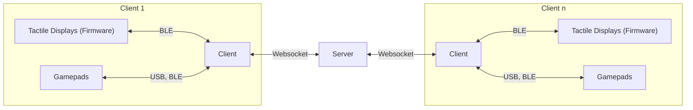

# CollabJam

base repo used to organize collaboration across hardware and software development.

| Repository     | Description                                                                                  |
| -------- | -------------------------------------------------------------------------------------------- |
| [Client](https://github.com/TactileVision/CollabJam-Client)   | Electron Application that provides a GUI for colloratively creating vibration output         |
| [Server](https://github.com/TactileVision/CollabJam-Server)   | NodeJS server application that connects multiple clients                                     |
| [Shared](https://github.com/TactileVision/CollabJam-Firmware)   | Typescript types used both by the client and the server                                      |
| [Firmware](https://github.com/TactileVision/CollabJam-Firmware) | Firmware for ESP32 boards to communicate with the Collabjam Client via BLE, uses Platformio  |

- [Simple installation guide](doc/INSTALL.md)
- [Documentation about the code](doc/CODE.md)
