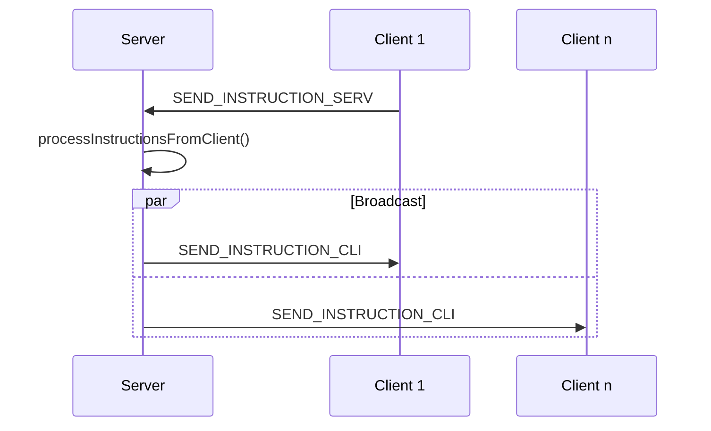
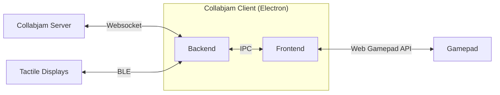
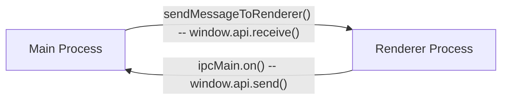

## Server (TODO)

The Collabjam-Server is a NodeJS application that communicates with Collabjam-Clients through websocket connections. It has two responsibilities, (1) Propagating the available rooms a client can join and (2) responding to the actions a clients executes by broadcasting the appropriate answer to all clients in the same room when jamming. The core components of Collabjam-Server are [express.js](https://expressjs.com) and the [*ws* websocket implementation](https://github.com/websockets/ws?tab=readme-ov-file).  

Upon receiving a http request from a client, server and client negotiate the websocket connection[^2].

The server shares the available rooms based on requests from a client.

It is also responsible for broadcasting jamming inputs and control commands from one client to all in the room.
Additionally, the server tracks the recording time of a room and ends it after a specific amount of time, that can be configured in the json definition of the room.



- describe the reaction to an request within a room

[^2]:<https://sookocheff.com/post/networking/how-do-websockets-work/>

### Data Structures

- Room Configuration
- Tacton JSON

## Client (TODO)

<!-- ### Application Information -->
The Collabjam-Client is an Electron application and development requires basic knowledge about:

- Typescript
- Electron
- Vue.js
  - VueX Store
  - Vuetify Library
- Node.js
- Bluetooth Low Energy



### Electron

The client is split into frontend(renderer process) and backend(main process). The frontend contains components that, outside of Electron, would run in the browser, the backend includes the parts that would run on the webserver.
In addition to being an Electron app, Collabjam-Client is build with [Vue.js](https://vuejs.org). [Vue CLI Plugin Electron Builder](https://nklayman.github.io/vue-cli-plugin-electron-builder/) is used to build the app, instead of the vanilla [Electron builder](https://www.electron.build).

Relevant Files for working with the Vue+Electron structure are:
| File          | Purpose                                                                                                    |
| ------------- | ---------------------------------------------------------------------------------------------------------- |
| main.js       | Entry point for the renderer part of the electron app. Initialization of Vue, Vue store and input handling |
| App.vue       | Contains the basic layout of the application. All other views are inserted into this View                  |
| background.ts | The file where the application window gets configured(resolution, title, ...) and instantiated             |
| preload.js    | Defines which functions are exposed between renderer and main process (see IPC, further reading)           |

#### IPC

To communicate between frontend/renderer and backend/os level components, Electron uses inter-process communication. [^1]

[^1]:<https://www.electronjs.org/docs/latest/tutorial/ipc>)

- `ipcMain` (Communicate asynchronously from the main process to renderer processes.)
- `ipcRenderer` (Communicate asynchronously from a renderer process to the main process.)



- The renderer process uses `window.api.send()` and `window.api.receive()` to communicate with the main process
  - The sending functions are spread across the codebase
  - The receiving functions of the renderer process are all clustered in `core/IPC/IpcRendererListener.ts`
- The main process uses the `sendMessageToRenderer()` to send data to the frontend. The `ipcMain.on` function allows the main process to receive data from the renderer.
  - Both the `sendMessageToRenderer()` and all receiving functions of the main process are defined in  `core/IPC/IpcMainController.ts`

##### Messages

- Strings define the different message types in IPC. The messages for the Collabjam-Client are defined in the `[core/IPC/IpcChannels.ts]` file
- (⚠️WIP) The messages are structured in the `function.target.message` scheme
  - e.g. `bluetooth.main.writeAmplitudeBuffer` is a message coming from the renderer process targeting to the bluetooth functionality of the main process
  - e.g. `bluetooth.renderer.connectedToDevice` is a message from the main process, informing the renderer process about a newly connected device

### Folder Structure

- The folder structure of collabjam-client groups the code into features and groups them into three categories:  
  - **App** contains the infrastructure components of the application:
    - Routing
    - Vue Store
    - The fundamental Vue Views defining the always available UI  
      - **Root View** All other views are injected into the root view
      - Sidebar
  - **Core** is made up of the base functionality of the CollabJam client application
    - IPC
    - Managing BLE Connections
    - A basic API for tactile displays
  - ⚠️ Features: Views and functions based on top of the core features

- Each (sub)category is a folder
- If there is both frontend and backend code for the feature, split in `main` and `render`
- Use a `types` folder for definition of interfaces the feature provides

### Frontend / Renderer Process

- Vue.js
- Vuetify

### Backend/ Main Process

The Collabjam-Client backend communicates with the Collabjam-Server via websocket and handles the BLE connection with tactile displays running the Collabjam-Firmware.

#### Bluetooth

The [@abandonware/noble](https://github.com/abandonware/noble) package handles working with BLE peripherals. There are some drawbacks using the package.
  
  1. The package is community maintained (hence the term *abandonware*)
  2. Extra work needed to run on  Windows and Linux bases systems (TODO: Add Link to package readme).
     1. ⚠️ At the moment we're not able to actually build a Windows version, because of errors occurring on launch. Serving the application is the only option for Windows based machines right now
     2. ⚠️ Getting the package to run on Linux requires work in the Terminal (Permissions) TODO:(Add link to Richards docs )
  3. ⚠️ No knowledge about already connected devices. When reloading the app, while being connected to a device, the package does not inform about the connection.

In Collabjam-Client basic bluetooth functionality is implemented in `core/Ble/main`.

- `BleController` interfaces with the `@abandonware/noble` package
- `BlePeripheralConnectionManager` stores discovered and connected peripherals and offers an interface to change the connection status of peripherals
- `BleServices` defines the custom BLE-service used to interface with Collabjam-Firmware. The service is define by one service uuid and many characteristics that also have an uuid and an optional callback method that will be called when the characteristic is discovered.

#### Tactile Display API

On top of the `core/Ble` stack, `core/TactileDisplays/main/TactileDisplayCharacteristicWriter` exposes  functions to interface with the tactile dislay on a application level. Currently, the amplitude and the frequency of a tactile display can be changed.

```Typescript
// TactileDisplayCharacteristicWriter.ts
// Peripheral originates from @abandonware/noble
export const writeAmplitudeBuffer = (device: Peripheral, taskList: TactileTask[]) => {
    const service = device.services.find((x) => x.uuid === tactileDisplayService.service.uuid)
    if (service !== undefined) {
        const characteristic = service.characteristics.find((characteristic) => characteristic.uuid === tactileDisplayService.characteristics!.amplitudeValues.uuid);
        if (characteristic !== undefined) {

            const buf = getBufferFromAmplitudeTasks(taskList)
            writeAmplitudeBufferCharacteristic(buf, characteristic);
        }
    }
}

//shared/types/tactonTypes.ts
export interface TactileTask {
 channelIds: number[],
 intensity: number,
}
```

To use the API from the rendering process of electron, use IPC calls

```Typescript
   window.api.send(IPC_CHANNELS.bluetooth.main.writeAmplitudeBuffer, {
    deviceId: this.actuators[0].deviceUuid,
    taskList: [
     {
      channelIds: [this.actuators[0].actuator],
      intensity: leftIntensity,
     },
    ]
   });
```

## Firmware (TODO)

## Inter Component Communication (TODO)

### Websocket Communication between Server and Client (Shared Library)

### Tactile Display  (Client - Firmware)

#### BLE Protocol

#### MIDI Implementation
